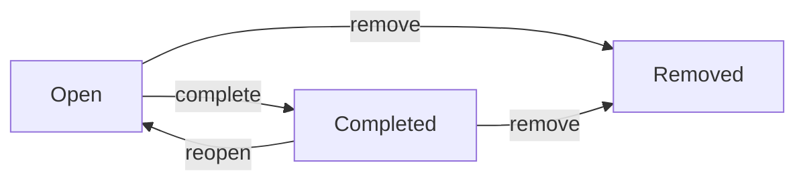

import { Aside } from '@astrojs/starlight/components';

`carryctx progress` records small, granular events against a task while you work: todos you notice mid-flight, blockers that stop you, risks worth flagging, and free-form notes. These are lighter weight than [checkpoints](/2-cli-reference/4-checkpoints/) and don't touch Git; they exist so a task's running log survives context loss even between checkpoints.

<Aside type="tip">
Session commands (`carryctx session start` / `end`) are covered on the [Project & Lifecycle](/2-cli-reference/1-project-lifecycle/) page. This page covers progress items only.
</Aside>

## The four item types

Every progress item has a `content` string and one of four types, set by the subcommand you use:

```bash
carryctx progress todo "Add integration test for the retry path" --task CTX-0001
carryctx progress block "Blocked on missing API key for staging" --task CTX-0001
carryctx progress risk "Migration touches shared table, needs review" --task CTX-0001
carryctx progress note "Chose polling over websockets for simplicity" --task CTX-0001
```

| Command | Item type | Typical use |
| --- | --- | --- |
| `progress todo` | `todo` | Something you still need to do |
| `progress block` | `blocker` | Something currently stopping you |
| `progress risk` | `risk` | A concern or trade-off worth surfacing later |
| `progress note` | `note` | Any other observation |

All four take the same arguments: a positional `content` string, and an optional `--task <TASK_REF>`. If `--task` is omitted, the item attaches to the task currently bound to the active session or worktree. If no task can be resolved, the command fails with "No task specified."

Each item is recorded with a `PX-####` display ID (e.g. `PX-0001`) so you can refer to it later without the full ULID, and it is stamped with the session ID it was created under, if any.

## Listing and inspecting items

```bash
carryctx progress list --task CTX-0001
```

Lists open progress items for a task (items with status `removed` are excluded). Add `--format markdown` at the top level for a table:

```text
# Progress Items

| ID | Type | Content | Status | Position |
|---|---|---|---|---|
| PX-0001 | Todo | Add integration test for the retry path | Open | 0 |
| PX-0002 | Blocker | Blocked on missing API key for staging | Open | 1 |
```

`--task` is required for `progress list`; there's no implicit "active task" fallback here.

To see the full record for a single item (content, type, status, task, timestamps):

```bash
carryctx progress show PX-0002
```

`show` accepts either the `PX-####` display ID or the raw ULID.

## Editing content

```bash
carryctx progress edit PX-0002 --content "Blocked on missing API key; requested from platform team"
```

`edit` replaces the item's `content` in place. It doesn't change type, status, or position, and the edit is recorded as a separate event so the original text isn't lost from the audit trail.

## Lifecycle: open, completed, removed

A progress item starts in the `open` state. From there:



```bash
carryctx progress complete PX-0001   # open -> completed
carryctx progress reopen PX-0001     # completed -> open
carryctx progress remove PX-0001     # open or completed -> removed
```

Only these transitions are valid: `complete` requires the item to be `open`, `reopen` requires it to be `completed`, and `remove` works from either `open` or `completed`. Attempting an invalid transition (for example, completing an already-completed item) fails with an invalid-transition error rather than silently succeeding. There is no command to undo a `remove`; treat it as final.

<Aside type="note">
`remove` doesn't delete the row from the database, it marks the item `removed` and excludes it from default listings. The item and its history remain queryable by ID.
</Aside>

## Reordering

Progress items carry a `position` used for display ordering within a task. To rearrange them:

```bash
carryctx progress reorder --task CTX-0001 --order PX-0002 --order PX-0001 --order PX-0003
```

`--order` is repeatable and takes progress refs (display IDs or ULIDs) in the exact sequence you want them to appear. `--task` is required.

## How progress relates to tasks and sessions

- Every progress item is bound to exactly one task (`--task`, or the resolved current task).
- If created during an active session, the item records that session's ID, so `carryctx resume` and `carryctx context` can pull a task's open items back into view automatically.
- Progress items feed into [`carryctx checkpoint`](/2-cli-reference/4-checkpoints/) indirectly: a checkpoint's `--done`/`--remaining`/`--blocker`/`--risk`/`--note` flags are a separate, point-in-time report you write yourself, not a copy of progress items. Use `progress` for the running log, and `checkpoint` when you want a durable, Git-anchored snapshot.
