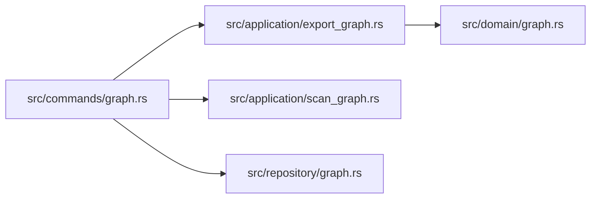

import { Aside } from '@astrojs/starlight/components';

`carryctx graph` builds and queries a lightweight dependency graph of your codebase, stored alongside tasks and checkpoints in the same project database. It's not a full AST/type-checker graph: it extracts file-to-file `depends_on` edges from import/require/use statements, then lets you inspect, extend, and export that graph. Use it to answer "what does this file pull in" or "what would break if I change this module" without leaving the terminal.

## Scanning a repository

```bash
carryctx graph scan
```

Walks every git-tracked file under the repository root, matches it against a set of file extensions, and extracts dependency edges into the graph. Flags:

| Flag | Default | Purpose |
| --- | --- | --- |
| `--dir <PATH>` | `.` | Directory to scan (relative to where you run the command) |
| `--ext <LIST>` | `rs,ts,js,tsx,jsx` | Comma-separated file extensions to include |
| `--dry-run` | off | Print what would be scanned/extracted without writing to the database |

```bash
carryctx graph scan --dir src --ext rs,ts,tsx
```

The command reports how many files were scanned, how many were skipped, and how many nodes/edges were created:

```json
{
  "dryRun": false,
  "extensions": ["rs", "ts", "tsx"],
  "scanned": 84,
  "skipped": 3,
  "nodesCreated": 84,
  "edgesCreated": 211,
  "errorCount": 0,
  "errors": []
}
```

Re-running `graph scan` is safe. It's meant to be run again after refactors so the graph stays close to what's actually in the tree; it doesn't diff against a previous scan, it just re-extracts and inserts.

<Aside type="tip">
`graph scan` only looks at files Git already tracks. Untracked or ignored files (build output, `node_modules`, etc.) are never scanned.
</Aside>

## Inspecting nodes and edges manually

Most of the time `graph scan` populates the graph for you, but you can also build it up by hand:

```bash
# Create a node explicitly
carryctx graph add-node --node-type module --name "src/auth/session.rs" --description "Session token validation"

# Link two existing nodes with a relation
carryctx graph link <SOURCE_ULID> <TARGET_ULID> depends_on

# Extract depends_on edges from a single file on demand
carryctx graph extract-deps src/auth/session.rs

# List every edge connected to a node
carryctx graph edges <NODE_ULID>
```

`add-node` takes `--node-type` (e.g. `file`, `module`, `decision`) and `--name`, with an optional `--description`. `link` takes a source ULID, a target ULID, and a free-form relation string (conventionally `depends_on`, but the graph doesn't enforce a fixed vocabulary). `edges` takes the ULID of a node and lists everything connected to it, in either direction.

## Exporting the graph

```bash
carryctx graph export --type mermaid
```

`graph export` renders the whole graph, or a scoped subgraph, in one of four formats via `--type` (alias `--format`, default `mermaid`):

| Format | Value | Notes |
| --- | --- | --- |
| Mermaid | `mermaid` (also `mmd`) | `graph LR` diagram, pastes straight into Markdown |
| Graphviz DOT | `dot` (also `graphviz`) | Pipe through `dot -Tsvg` yourself, or use `--output` below |
| ASCII | `ascii` (also `txt`) | Plain-text box diagram for terminal viewing |
| JSON | `json` | Raw nodes/edges, for scripting |

There's also a standalone `--ascii` boolean flag that forces ASCII output regardless of `--type`, useful when you don't want to remember the format string.

### Scoping with `--focus` and `--depth`

Exporting the entire graph of a large repo is noisy. `--focus <NAME_OR_ULID>` restricts the export to the subgraph reachable from one node, and `--depth <N>` (default `1`) controls how many hops out from that node to include:

```bash
carryctx graph export --type mermaid --focus src/auth/session.rs --depth 2
```

This walks two hops of `depends_on` edges outward from `src/auth/session.rs` and renders only that neighborhood, instead of every file in the project.

Other export flags:

- `--node-type <TYPE>` filters the exported nodes by type (e.g. only `file` nodes, skipping `decision` or `task` nodes that may share the graph).
- `--compact` aggregates nodes into module-level clusters (e.g. everything under `src/commands` collapses into one cluster node) so large graphs stay readable.
- `--output <PATH>` writes the result to a file instead of stdout. For `dot` input with a `.png`/`.svg` output path, CarryCtx shells out to a local `dot` binary to render the image; for other formats it writes the raw text/JSON.

### Worked example

Scan the repo, then export a focused Mermaid diagram for one file two hops deep, saved to a file for a PR description:

```bash
carryctx graph scan --dir src --ext rs
carryctx graph export --type mermaid --focus src/commands/graph.rs --depth 2 --output /tmp/graph-focus.mmd
```

```text
Successfully exported graph to /tmp/graph-focus.mmd
```



Drop the resulting `.mmd` content straight into a GitHub PR description or a Markdown doc; GitHub renders Mermaid fences natively.

<Aside type="note">
Everything under `carryctx graph` also runs against the same database CarryCtx uses for tasks and checkpoints, so `--focus` accepts any node the graph knows about, not just files. A `decision` or `task` node created elsewhere can be a focus point too, if you've linked it into the graph with `add-node`/`link`.
</Aside>
