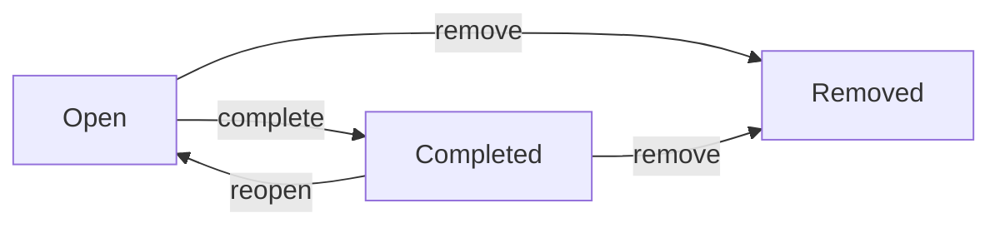

import { Aside } from '@astrojs/starlight/components';

`carryctx progress` 用于在工作过程中记录任务上的细粒度事件：临时想到的待办事项、卡住你的阻塞点、值得标记的风险，以及自由格式的备注。它比[检查点（checkpoint）](/zh-cn/2-cli-reference/4-checkpoints/)更轻量，不涉及 Git；其存在的目的是让任务的运行日志即使在两次检查点之间也不会因上下文丢失而消失。

<Aside type="tip">
会话相关命令（`carryctx session start` / `end`）已在[项目与生命周期](/zh-cn/2-cli-reference/1-project-lifecycle/)页面中介绍。本页只涉及进度条目本身。
</Aside>

## 四种条目类型

每个进度条目都有一个 `content` 字符串，以及由所用子命令决定的四种类型之一：

```bash
carryctx progress todo "为重试路径添加集成测试" --task CTX-0001
carryctx progress block "缺少 staging 环境的 API key,被阻塞" --task CTX-0001
carryctx progress risk "此次迁移涉及共享表,需要评审" --task CTX-0001
carryctx progress note "为简化实现选择轮询而非 websocket" --task CTX-0001
```

| 命令 | 条目类型 | 典型用途 |
| --- | --- | --- |
| `progress todo` | `todo` | 还需要做的事 |
| `progress block` | `blocker` | 当前正在阻塞你的事 |
| `progress risk` | `risk` | 值得后续留意的风险或权衡 |
| `progress note` | `note` | 其他任何观察记录 |

四个子命令的参数完全一致：一个位置参数 `content` 字符串,和可选的 `--task <TASK_REF>`。省略 `--task` 时,条目会附加到当前会话或工作树绑定的任务上；如果无法解析出任务,命令会失败并提示 "No task specified."

每个条目都会分配一个 `PX-####` 形式的展示 ID（例如 `PX-0001`），方便你之后引用而不必用完整 ULID，并且会记录创建时所在的会话 ID（如果存在）。

## 列出与查看条目

```bash
carryctx progress list --task CTX-0001
```

列出某个任务的所有开放（open）进度条目（状态为 `removed` 的条目不会出现）。在顶层加上 `--format markdown` 可以得到表格输出：

```text
# Progress Items

| ID | Type | Content | Status | Position |
|---|---|---|---|---|
| PX-0001 | Todo | 为重试路径添加集成测试 | Open | 0 |
| PX-0002 | Blocker | 缺少 staging 环境的 API key,被阻塞 | Open | 1 |
```

`progress list` 的 `--task` 是必填的,这里不存在隐式的"当前任务"回退逻辑。

查看单个条目的完整记录（内容、类型、状态、所属任务、时间戳）：

```bash
carryctx progress show PX-0002
```

`show` 接受 `PX-####` 展示 ID 或原始 ULID。

## 编辑内容

```bash
carryctx progress edit PX-0002 --content "缺少 API key;已向平台组申请"
```

`edit` 会原地替换条目的 `content`,不会改变类型、状态或排序位置,且编辑操作会作为独立事件记录,不会丢失原始文本的审计痕迹。

## 生命周期：open、completed、removed

进度条目创建时的初始状态是 `open`。之后可以流转为：



```bash
carryctx progress complete PX-0001   # open -> completed
carryctx progress reopen PX-0001     # completed -> open
carryctx progress remove PX-0001     # open 或 completed -> removed
```

只有这些转换是合法的：`complete` 要求条目当前是 `open`;`reopen` 要求条目当前是 `completed`;`remove` 可以从 `open` 或 `completed` 任一状态执行。尝试非法转换（例如对已完成的条目再次执行 complete）会返回状态转换错误,而不会静默成功。没有命令可以撤销 `remove`,请将其视为终态。

<Aside type="note">
`remove` 不会从数据库中真正删除该行,只是把条目标记为 `removed` 并从默认列表中排除。该条目及其历史仍可通过 ID 查询到。
</Aside>

## 重新排序

进度条目带有一个 `position` 字段,用于控制同一任务内的展示顺序。要调整顺序：

```bash
carryctx progress reorder --task CTX-0001 --order PX-0002 --order PX-0001 --order PX-0003
```

`--order` 可重复传入,按你想要的最终顺序依次填入进度条目引用（展示 ID 或 ULID）。`--task` 为必填项。

## 进度条目与任务、会话的关系

- 每个进度条目都精确绑定到一个任务（通过 `--task`,或自动解析出的当前任务）。
- 如果条目是在活跃会话期间创建的,会记录该会话 ID,这样 `carryctx resume` 和 `carryctx context` 就能自动把任务的开放条目重新带入视野。
- 进度条目与 [`carryctx checkpoint`](/zh-cn/2-cli-reference/4-checkpoints/) 之间是间接关联：checkpoint 的 `--done`/`--remaining`/`--blocker`/`--risk`/`--note` 参数是你自己撰写的、某个时间点的独立报告,并不是进度条目的自动拷贝。日常运行中的记录用 `progress`,想要一份持久、锚定到 Git 状态的快照时用 `checkpoint`。
