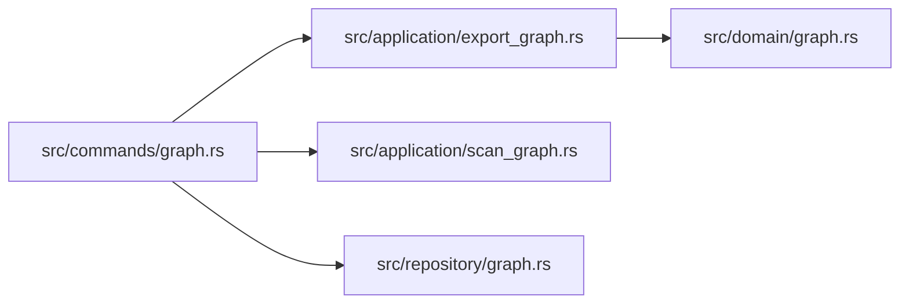

import { Aside } from '@astrojs/starlight/components';

`carryctx graph` 在与任务、检查点相同的项目数据库中构建并查询一份轻量级的代码依赖图。它并不是一套完整的 AST/类型检查图：它从 import/require/use 语句中提取文件间的 `depends_on` 边，然后让你检查、扩展和导出这份图。不需要离开终端，就能回答「这个文件依赖了什么」或者「改动这个模块会波及哪些地方」。

## 扫描仓库

```bash
carryctx graph scan
```

遍历仓库根目录下每一个被 Git 跟踪的文件，按扩展名过滤，将提取出的依赖边写入图谱。参数：

| 参数 | 默认值 | 作用 |
| --- | --- | --- |
| `--dir <PATH>` | `.` | 要扫描的目录（相对于运行命令时的工作目录） |
| `--ext <LIST>` | `rs,ts,js,tsx,jsx` | 逗号分隔的文件扩展名列表 |
| `--dry-run` | 关闭 | 只打印将要扫描/提取的内容，不写入数据库 |

```bash
carryctx graph scan --dir src --ext rs,ts,tsx
```

命令会报告扫描了多少文件、跳过了多少、创建了多少节点/边：

```json
{
  "dryRun": false,
  "extensions": ["rs", "ts", "tsx"],
  "scanned": 84,
  "skipped": 3,
  "nodesCreated": 84,
  "edgesCreated": 211,
  "errorCount": 0,
  "errors": []
}
```

重复运行 `graph scan`是安全的。它不会跟上一次扫描做增量对比，只是重新提取并插入，因此建议在每次重构后重新扫描一遍，让图谱保持贴近当前代码树的实际状态。

<Aside type="tip">
`graph scan` 只会查看 Git 已跟踪的文件。未跟踪或被 ignore 的文件（构建产物、`node_modules` 等）永远不会被扫描到。
</Aside>

## 手动检查节点和边

大多数时候 `graph scan` 会替你把图谱填好，但你也可以手动构建：

```bash
# 显式创建一个节点
carryctx graph add-node --node-type module --name "src/auth/session.rs" --description "Session token validation"

# 用一条关系连接两个已有节点
carryctx graph link <SOURCE_ULID> <TARGET_ULID> depends_on

# 按需从单个文件提取 depends_on 边
carryctx graph extract-deps src/auth/session.rs

# 列出与某节点相连的所有边
carryctx graph edges <NODE_ULID>
```

`add-node` 接受 `--node-type`（例如 `file`、`module`、`decision`）和 `--name`，可选 `--description`。`link` 接受源节点 ULID、目标节点 ULID，以及一个自由文本的关系字符串（约定用 `depends_on`，但图谱本身不强制固定词汇）。`edges` 接受一个节点 ULID，列出与它双向相连的所有边。

## 导出图谱

```bash
carryctx graph export --type mermaid
```

`graph export` 可以渲染整张图，也可以渲染一个限定范围的子图，通过 `--type`（别名 `--format`，默认 `mermaid`）在四种格式间切换：

| 格式 | 取值 | 说明 |
| --- | --- | --- |
| Mermaid | `mermaid`（也可用 `mmd`） | `graph LR` 图，可直接粘贴进 Markdown |
| Graphviz DOT | `dot`（也可用 `graphviz`） | 自行用 `dot -Tsvg` 转换，或使用下面的 `--output` |
| ASCII | `ascii`（也可用 `txt`） | 纯文本框图，适合在终端查看 |
| JSON | `json` | 原始节点/边数据，便于脚本处理 |

此外还有一个独立的布尔参数 `--ascii`，无论 `--type` 是什么都强制输出 ASCII 格式，适合懒得记格式字符串时用。

### 用 `--focus` 和 `--depth` 限定范围

导出整个大型仓库的图谱会非常嘈杂。`--focus <NAME_OR_ULID>` 把导出限定为从某个节点可达的子图，`--depth <N>`（默认 `1`）控制从该节点向外扩展多少跳：

```bash
carryctx graph export --type mermaid --focus src/auth/session.rs --depth 2
```

这会从 `src/auth/session.rs` 出发，沿着 `depends_on` 边向外走两跳，只渲染这一片邻域，而不是项目里所有文件。

其它导出参数：

- `--node-type <TYPE>` 按类型过滤导出的节点（例如只保留 `file` 节点，跳过可能共享同一张图的 `decision` 或 `task` 节点）。
- `--compact` 把节点聚合成模块级的簇（例如 `src/commands` 下的所有文件会折叠成一个簇节点），让大图保持可读。
- `--output <PATH>` 把结果写入文件而非标准输出。如果输入是 `dot` 且输出路径是 `.png`/`.svg`，CarryCtx 会调用本机的 `dot` 二进制来渲染图片；其它格式则直接写入原始文本/JSON。

### 一个完整例子

先扫描仓库，再为某个文件导出一份两跳深度、聚焦的 Mermaid 图，保存成文件用于 PR 描述：

```bash
carryctx graph scan --dir src --ext rs
carryctx graph export --type mermaid --focus src/commands/graph.rs --depth 2 --output /tmp/graph-focus.mmd
```

```text
Successfully exported graph to /tmp/graph-focus.mmd
```



把生成的 `.mmd` 内容直接贴进 GitHub PR 描述或 Markdown 文档即可；GitHub 原生支持渲染 Mermaid 代码块。

<Aside type="note">
`carryctx graph` 底下的所有命令都跑在与任务、检查点相同的那份数据库上，因此 `--focus` 可以指向图谱认得的任何节点，不局限于文件。如果你用 `add-node`/`link` 把某个 `decision` 或 `task` 节点接入了图谱，它同样可以作为一个 focus 点。
</Aside>
